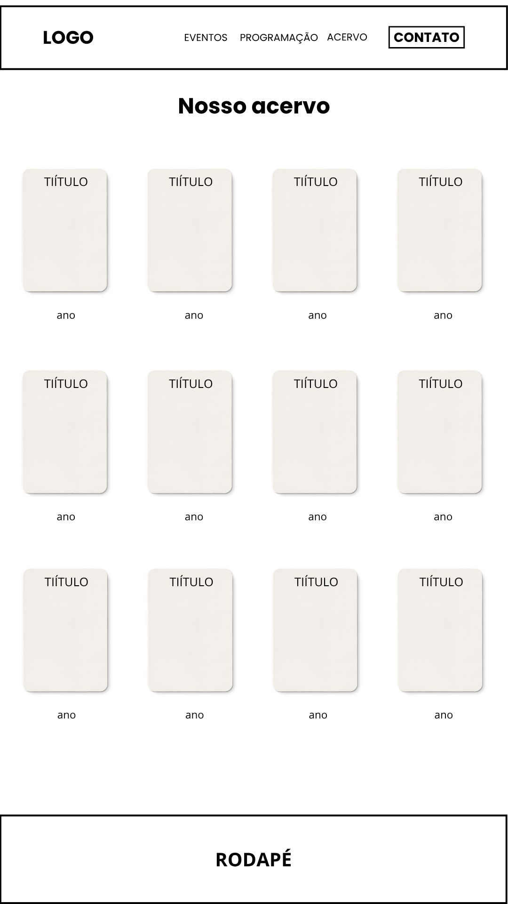
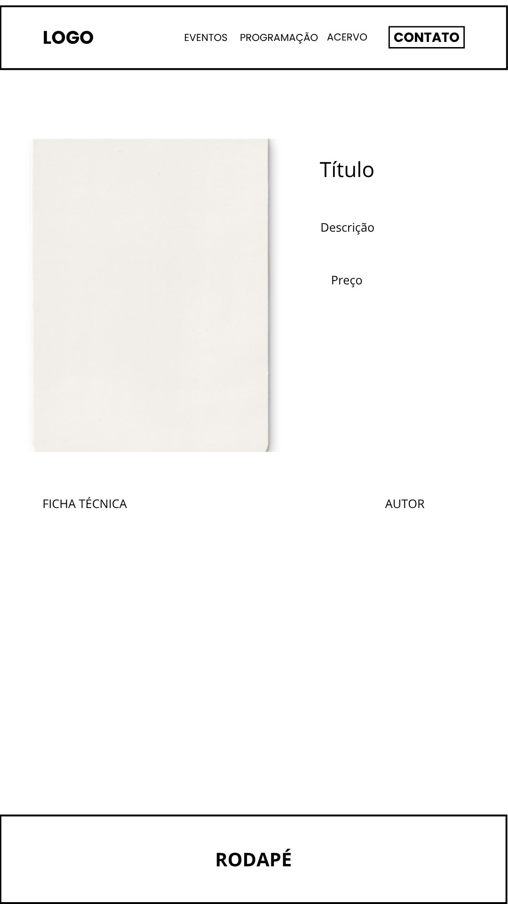
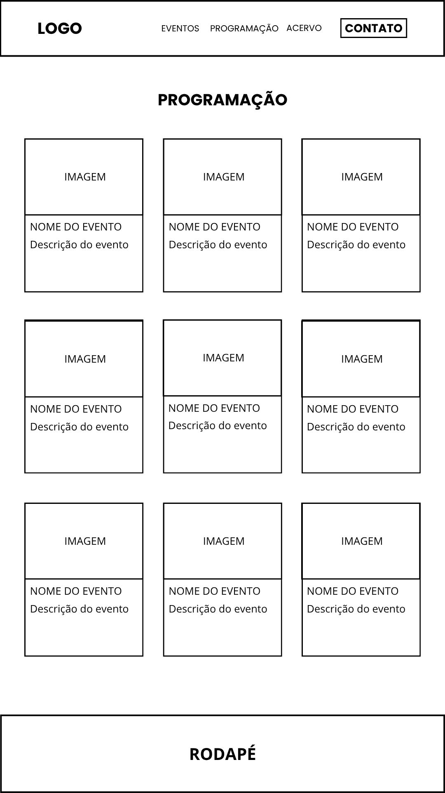
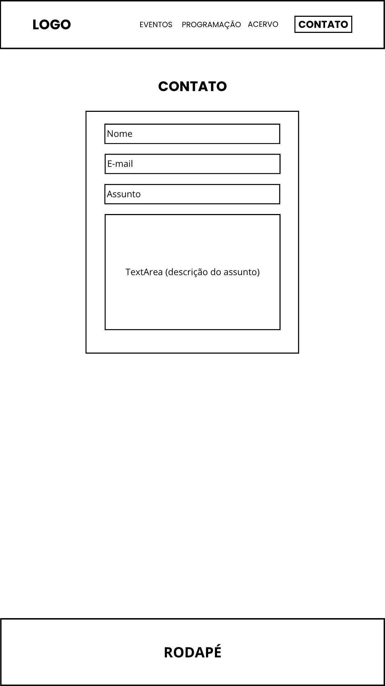
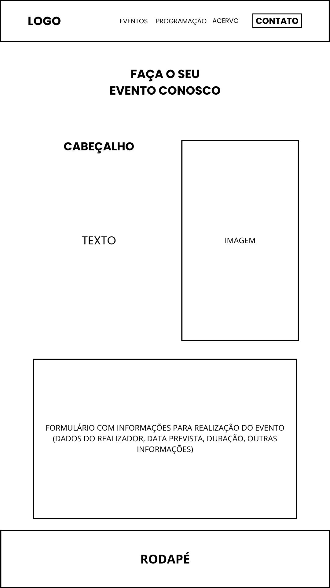

# projeto_borboleta_02H

### Alunos:

- Guilherme Pinho - 10755529
- Moabe da Silva Guedes Rêgo - 10748053
- Ryan Silva de Sousa - 10757255

---

## Processo de Ideação

Iniciando o Projeto Borboleta (continuação direta do Projeto Lagarta), mantemos a home do site da biblioteca sem alterações, adicionando somente as novas páginas que faltaram anteriormente: Programação, Acervo, Eventos, Contato e a página de cada livro.
Para isso, buscamos referências em sites de bibliotecas, livrarias e editoras já existentes, como a do Centro Cultural de São Paulo, da Editora Aleph, Biblioteca de São Paulo, entre outras.
Ainda com o caráter extensionista, mantivemos o compromisso de apresentar um layout amigável e simples durante a navegação, além de considerar as implementações futuras de API e a migração para nextJS durante a criação dos novos wireframes, facilitando esse processo futuramente.

## Explicação do Wireframe

Quando clicamos na aba de acervo no Menu o conteúdo do site é direcionado ao nosso catálogo de livros onde estão separados em cards contendo seu titulo e ano de lançamento, apenas como uma forma prévia de visualização para o usuário que ao clicar no livro de interesse é redirecionado para uma navegação dinâmica.

A página mostra o livro em alta resolução e com mais detalhes sobre sua descrição, ficha técnica, preço. Essa página irá servir como modelo só mudando as informações do livro escolhido na página anterior.

Na página de programação, temos um layout simples e semelhante ao do acervo, utilizando um card base com uma imagem, o nome do evento e a descrição do mesmo. Se repetindo pela página dependendo de quantos eventos próximos existem.

Na página de contato, temos um formulário para que o usuário possa entrar em contato com a biblioteca, nesse formulário é necessário inserir o nome, e-mail, assunto e um texto com a explicação do assunto.

Na página de eventos, temos uma imagem representando os eventos realizados por empresas dentro da biblioteca, com um cabeçalho “convidando” o usuário e uma descrição do que pode ser feito no local. Abaixo tem um formulário para que a biblioteca receba propostas de eventos, com os dados do realizador, informações de data, horário e quantidade de convidados, entre outros.

## DOCUMENTAÇÃO DA MIGRAÇÃO DA HOME PAGE PRA NEXTJS

Primeiramente, depois de instalar o projeto em nextjs fizemos o upload de todas as imagens para a pasta public pois é nessa pasta que elas ficam disponíveis para todo o projeto.
